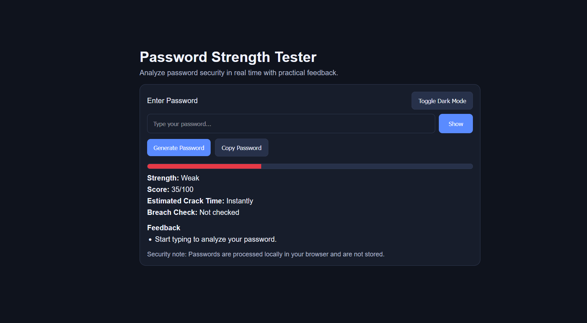

# Password Strength Tester

A complete HTML/CSS/JavaScript cybersecurity mini-project that analyzes password quality in real time.

## Project Overview

This app checks password complexity using rule-based scoring, detects weak patterns, and estimates crack time. It is designed as a portfolio-ready project you can upload directly to GitHub.

## Features

- Real-time password analysis as the user types
- Strength classification: Weak / Medium / Strong
- Score out of 100 using weighted security criteria
- Practical feedback and improvement suggestions
- Estimated crack time from "Instantly" to "Centuries"
- Detection of common words, repeated characters, and sequences
- Basic common-password list check
- Optional breached password check using Have I Been Pwned k-Anonymity API
- Bonus UI features:
  - Dark mode toggle
  - Show/hide password
  - Generate secure password
  - Copy password button
  - Strength meter animation

## Scoring Rules

| Rule | Points |
|------|--------|
| Length >= 8 | +10 |
| Length >= 12 | +10 |
| Uppercase letters | +10 |
| Lowercase letters | +10 |
| Numbers | +10 |
| Special characters | +15 |
| No common words | +15 |
| No repeated/sequential patterns | +10 |
| Not in common-password list | +10 |
| **Total** | **100** |

## Why This Matters (Interview Angle)

Weak passwords are vulnerable to brute force and dictionary attacks. This tool helps users choose stronger passwords by explaining what makes a password risky and how to improve it.

## How to Run

1. Download or clone this repository.
2. Open the project folder.
3. Double-click `index.html` or open it with Live Server in VS Code.

No build step or dependencies are required.

## Screenshots

### Light Mode (Strong Password)

### Dark Mode (Medium Password)

### Dark Mode (Strong Password)

## File Structure

- `index.html` - app layout
- `styles.css` - styling and animations
- `script.js` - scoring logic and UI behavior

## Security Notes

- Passwords are processed locally in the browser.
- Passwords are not stored.
- Breach check uses SHA-1 k-Anonymity API flow (prefix only), not direct password submission.
